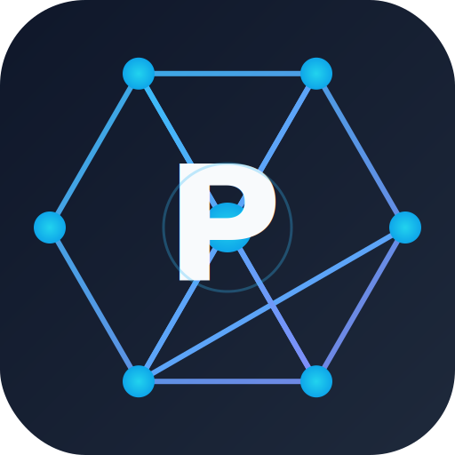

<p align="center">
  
</p>

<h1 align="center">PADAGONIA</h1>

<p align="center">
  <strong>P</strong>arallelisation <strong>A</strong>ccessible <strong>D</strong>atabase <strong>A</strong>dvance <strong>G</strong>enerative <strong>O</strong>ntology <strong>N</strong>etworked <strong>I</strong>nformation <strong>A</strong>rchitecture
</p>

<p align="center">
  A minimal Rust prototype of an ontology-native, immutable, provenance-rich graph store
  designed for autonomous AI agents.
</p>

<p align="center">
  🌸 <a href="docs/index.html">Browse the PADAGONIA website source</a> 🌸
</p>

## Features

- Interned ontology (labels, relations, property keys) for compact storage.
- Immutable nodes/edges annotated with agent provenance and confidence.
- Parallel-encodable/decodable binary blocks keyed by semantic cluster.
- Basic traversal, filtering, and BFS query APIs.
- Native HNSW approximate nearest-neighbor search over embeddings.
- JSON/JSONL/CSV projections.
- Deterministic synthetic benchmarks against NetworkX, SQLite, numpy, and hnswlib.

## Build & Test

```bash
cargo test
```

> **Kaptaind fallback:** The repo is configured for `kaptaind` auto-versioning
> and push. If the daemon is unavailable or its analysis decides not to bump,
> fall back to manual `git commit` / `git push` and keep `Cargo.toml` and
> `Cargo.lock` in sync with the `VERSION` file.

## CLI

```bash
# Generate a graph and write it to a PADAGONIA file
cargo run -- ingest --nodes 1000 --edges 5000 --seed 1 --out /tmp/test.pad

# Load and report statistics
cargo run -- load --in /tmp/test.pad

# BFS from node 0 to depth 4, optionally filtering by relation
cargo run -- bfs --in /tmp/test.pad --start 0 --depth 4
cargo run -- bfs --in /tmp/test.pad --start 0 --depth 2 --relation works_for

# Export to JSON
cargo run -- to-json --in /tmp/test.pad --out /tmp/test.json

# Run internal benchmark and write target/padagonia_bench_summary.json
cargo run -- bench --nodes 100000 --edges 500000

# Run vector-search benchmark and write target/padagonia_hnsw_summary.json
cargo run --release -- bench-vectors --nodes 100000 --dim 128 --k 10 --ef 50

# Query nearest neighbours from a PADAGONIA file
cargo run --release -- vector-search --in /tmp/test.pad --k 10 --ef 50

# Start the HTTP server (see padagonia.toml.example for configuration)
cargo run -- server --config padagonia.toml.example
```

## Benchmarks

Criterion benchmarks:

```bash
cargo bench
```

Python competitor harness:

```bash
python3 bench/competitors/generate_workload.py 100000 500000 42 bench/competitors
python3 bench/competitors/generate_vectors.py 100000 128 123 bench/competitors
python3 bench/competitors/benchmark_networkx.py bench/competitors
python3 bench/competitors/benchmark_sqlite.py bench/competitors
python3 bench/competitors/benchmark_hnsw.py bench/competitors
python3 bench/competitors/plot_report.py
```

The report is written to `BENCHMARK_REPORT.md`.

## Architecture

```
src/
  id.rs          # newtyped identifiers
  ontology.rs    # StringTable interning
  value.rs       # Scalar property values
  provenance.rs  # agent/model/confidence/cost/timestamp/evidence
  node.rs        # Node struct
  edge.rs        # Edge struct
  fact.rs        # FactSubject enum
  store.rs       # in-memory Store with indexes + save/load
  block.rs       # binary block format + file header
  query.rs       # QueryEngine traversal/filter API
  projection.rs  # adjacency/JSON/CSV export
  hnsw.rs        # native approximate nearest-neighbor index
  bench_support.rs # deterministic synthetic workload
```

### Storage format

- File header: magic `PADAGON\n`, version 1, global `StringTable`, block count.
- Blocks: one per `LabelId` for nodes and one per `RelationId` for edges.
- Each block stores its `BlockKind`, bincode-encoded payload, and a CRC32 checksum.
- Save encodes blocks in parallel with `rayon`; load validates checksums and decodes blocks in parallel.

## Contributing

Contributions are welcome! Please see [CONTRIBUTING.md](CONTRIBUTING.md) for
guidelines, and read our [Code of Conduct](CODE_OF_CONDUCT.md) before
participating.

To report security issues privately, see [SECURITY.md](SECURITY.md).

## License

PADAGONIA is licensed under either of the following, at your option:

- [Apache License, Version 2.0](LICENSE-APACHE)
- [MIT License](LICENSE-MIT)

Unless you explicitly state otherwise, any contribution intentionally submitted
for inclusion in PADAGONIA by you, as defined in the Apache-2.0 license, is
licensed as above without any additional terms or conditions.


